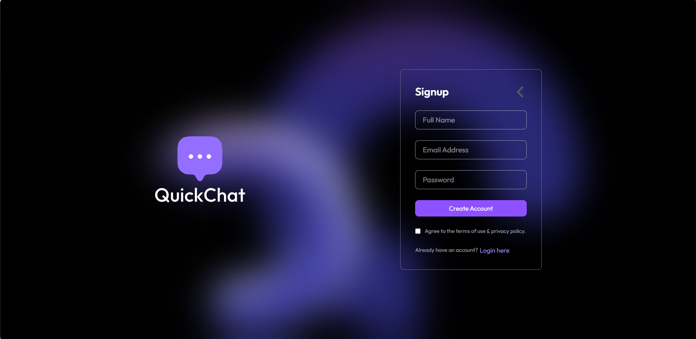
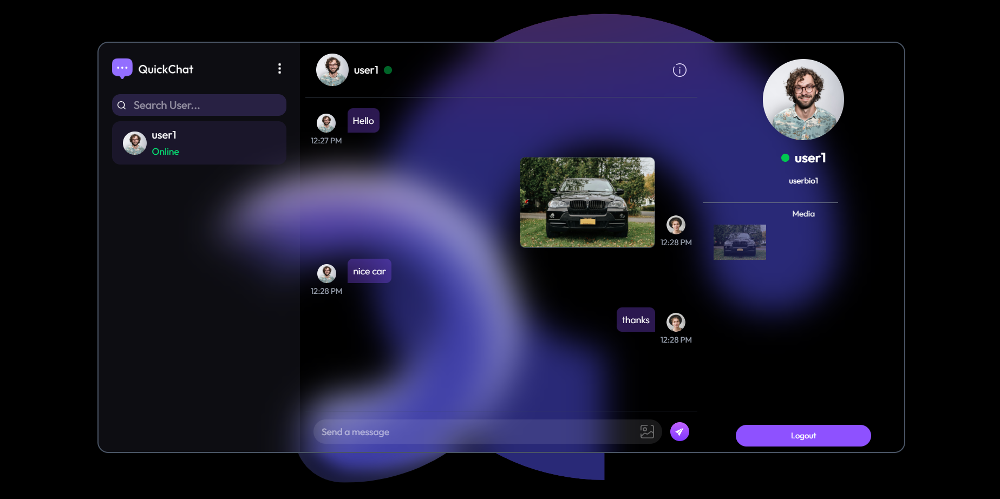
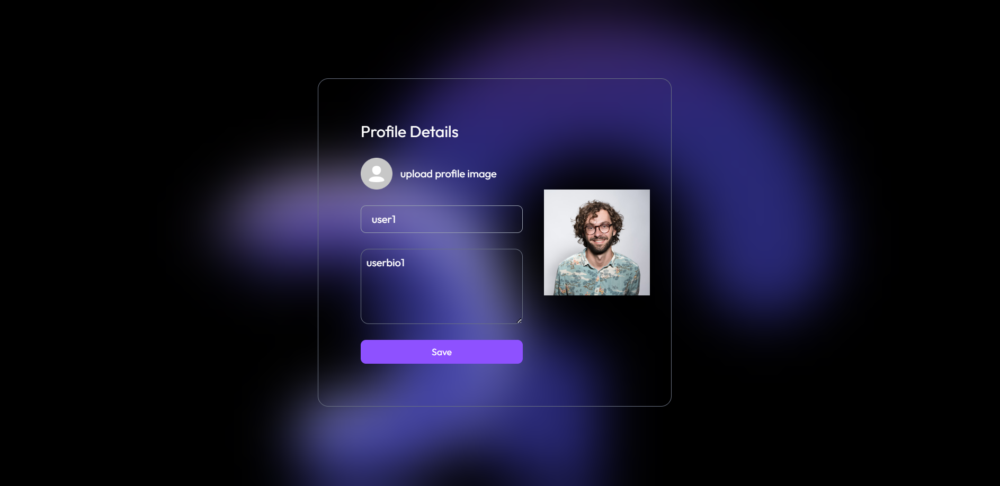

Fullstack Chat App 💬

Bu proje, kullanıcıların anlık olarak mesajlaşabileceği, profillerini düzenleyebileceği ve güvenli bir şekilde giriş yapabileceği kapsamlı bir Fullstack Sohbet Uygulamasıdır.

Kullanıcı dostu arayüzü ve gerçek zamanlı iletişim yetenekleriyle, modern mesajlaşma uygulamalarının temel dinamiklerini barındırır.

📸 Ekran Görüntüleri

Projenin temel arayüzlerine ait bazı görseller:

1. Kullanıcı Girişi (Login)

(Kullanıcıların hesap oluşturduğu ve güvenli giriş yaptığı ekran)

2. Mesajlaşma Arayüzü (Chat)

(Kullanıcıların anlık olarak sohbet ettiği, mesajların gerçek zamanlı aktığı ekran)

3. Profil Düzenleme

(Kullanıcıların kişisel bilgilerini, avatarlarını veya durumlarını güncelleyebildiği ekran)

✨ Özellikler

Kullanıcı Kimlik Doğrulaması (Authentication): Güvenli kayıt olma ve giriş yapma işlemleri (Örn: JWT veya oturum tabanlı).

Gerçek Zamanlı Mesajlaşma: Web socket teknolojisi sayesinde gecikmesiz, anlık yazışma deneyimi.

Profil Yönetimi: Kullanıcı adını, profil fotoğrafını ve kişisel bilgileri güncelleyebilme.

Responsive Tasarım: Hem masaüstü hem de mobil cihazlarda sorunsuz çalışan modern arayüz.

🛠️ Kullanılan Teknolojiler

(Not: Aşağıdaki listeyi kendi kullandığın teknolojilere göre düzenleyebilirsin)

Frontend:

React.js / Vue.js vs.

Tailwind CSS / Bootstrap / SCSS (Stil Yönetimi)

State Management (Redux, Context API vb.)

Backend:

Node.js & Express.js

Socket.io (Gerçek zamanlı iletişim için)

Veritabanı:

MongoDB / PostgreSQL / Firebase

🚀 Kurulum ve Çalıştırma

Projeyi kendi bilgisayarınızda çalıştırmak için aşağıdaki adımları izleyebilirsiniz:

Gereksinimler

Node.js (v14 veya üzeri önerilir)

NPM veya Yarn

Veritabanı bağlantı adresi (MongoDB URI vb.)

Adımlar

Depoyu klonlayın:

git clone https://github.com/serkanoztas/fullstack-chat-app.git
cd fullstack-chat-app

Gerekli paketleri yükleyin:

# Backend bağımlılıkları için:
cd backend
npm install

# Frontend bağımlılıkları için:
cd ../frontend
npm install

Çevre değişkenlerini (Environment Variables) ayarlayın:

Kök dizinde (veya backend dizininde) .env adında bir dosya oluşturun.

Gerekli anahtarları ekleyin (Örn: PORT, DB_URL, JWT_SECRET).

Projeyi başlatın:

# Backend sunucusunu başlatmak için (backend klasöründe):
npm run start

# Frontend uygulamasını başlatmak için (frontend klasöründe):
npm start

Uygulama genellikle http://localhost:3000 adresinde çalışacaktır.